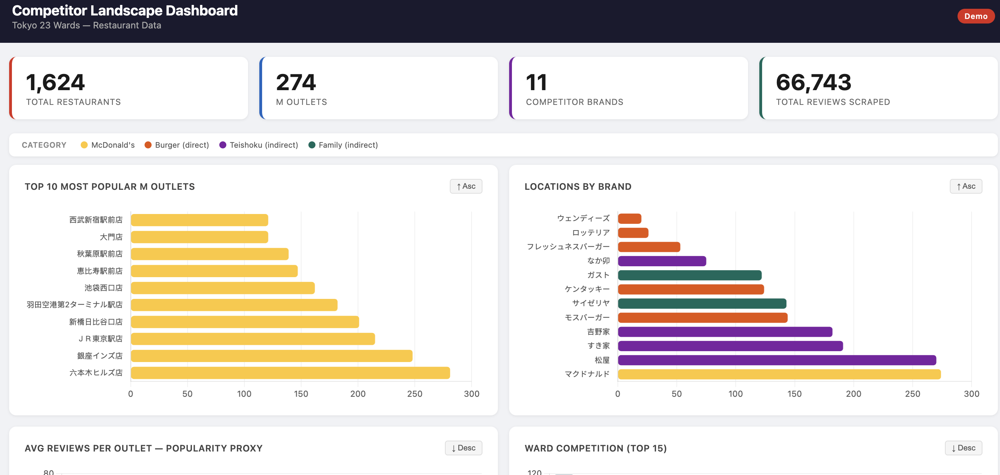
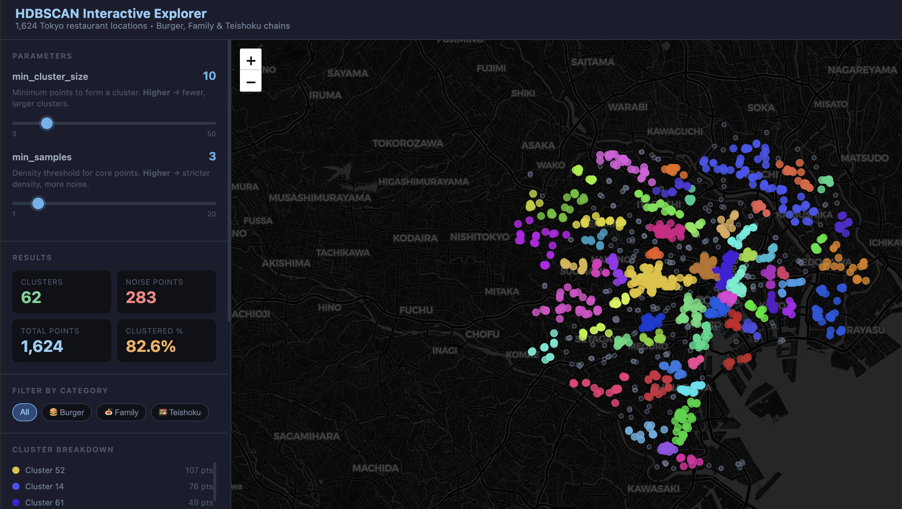

[🇯🇵 日本語](README.md) | [🇬🇧 English](README_EN.md)

# Geo-Intelligence 意思決定システム（Demo）

TabelogやGoogleMap等のクローリング可能なデータソースからレストランデータを収集し、HDBSCANで東京の飲食需要ゾーン(Demand Zone)をクラスタリングして、**M** の新規出店候補地をスコアリングするデータパイプライン。


| ダッシュボード | HDBSCANエクスプローラー |
|:---:|:---:|
|  |  |

---

## 仕組み

```
スクレイピング → 需要クラスタリング（HDBSCAN）→ 候補地スコアリング → インタラクティブマップ
```

1. **スクレイピング** — **M** および競合チェーンの位置情報・レビュー数を収集
2. **クラスタリング** — 全レストランをレビュー数で重み付けしてHDBSCANを実行し、飲食需要ゾーンを発見
3. **スコアリング** — クラスター需要・**M** 空白度・距離バッファの3指標で候補地をランキング
4. **選定** — 貪欲法NMS（最小間隔1.5km）で地理的に分散した上位50候補を選出
5. **出力** — インタラクティブFoliumマップ＋ランキングCSV

---

## プロジェクト構成

```
├── assets/
│   └── thumbnail.png                  # マップのプレビュー画像
│
├── output/
│   ├── interactive_map.html           # 自己完結型インタラクティブマップ（メイン成果物）
│   └── top_candidates.csv            # 候補地ランキング
│
├── scraper.py                         # Tabelogスクレイパー＋共通スクレイピングループ
├── scrape_location.py                 # 単一ブランド・区のスクレイプユーティリティ
├── scrape_tokyo_burger_chains.py      # バーガー競合チェーンのスクレイプ
├── scrape_tokyo_teishoku_chains.py    # 定食競合チェーンのスクレイプ
├── scrape_tokyo_family_chains.py      # ファミレス競合チェーンのスクレイプ
│
├── config.py                          # スクレイピング設定（チェーン・区・エイリアス）
├── config_modeling.py                 # モデリングパラメータ一覧
├── spatial_features.py                # BallTreeヘルパー（ハーバーサイン距離）
│
├── site_selection.py                  # フルパイプライン：クラスタリング → スコアリング → CSV出力
├── app_interactive.py                 # ライブコントロール付きインタラクティブHTMLマップ
│
└── requirements.txt
```

---

## セットアップ

```bash
pip install -r requirements.txt
```

---

## 使い方

### 1 — データの収集

各スクリプトは`data/`にデータが存在しないチェーンのみスクレイピングします。既存ブランドはキャッシュから自動読み込みされます。

```bash
python scrape_tokyo_burger_chains.py
python scrape_tokyo_teishoku_chains.py
python scrape_tokyo_family_chains.py
```

新しいチェーンを追加する場合は、`config.py`の該当する`DEFAULT_*_CHAINS`リストにスラグを追加し（必要に応じて`BRAND_ALIASES`にエイリアスも追加）、スクリプトを再実行してください。

### 2 — 候補地選定の実行

```bash
python site_selection.py     # output/top_candidates.csv を出力
python app_interactive.py    # output/interactive_map.html を出力
```

---

## インタラクティブマップ

`output/interactive_map.html` は完全自己完結型 — サーバー不要、任意のブラウザで開くだけで使用可能。実装の時、Dockerの使用をおすすめ。

**コントロール（右上レイヤーパネル）**
- **バーガー / 定食 / ファミレス ウェイト** — 各競合カテゴリが需要スコアに与える影響を調整（`0` = 無視、`1.0` = デフォルト、`2.0` = 2倍の影響）

**コントロール（右下パネル）**
- **スパースエリア信頼度** — HDBSCANノイズ再割り当て候補のメンバーシップウェイト（`0` = 非表示、`0.5` = デフォルト、`1` = 確定クラスターと同等）
- **表示候補数** — ランキング上位5〜50件を表示（デフォルト50件）

**マップ要素**
- 緑バッジ — 確定需要クラスターからの候補地
- 橙バッジ — 潜在需要のあるスパースエリアからの候補地
- 赤 **M** バッジ — 既存 **M** 店舗
- バッジの数字 = ランク　・　透明度 = スコア

---

## 競合カテゴリ

| カテゴリ | チェーン | ウェイト |
|---|---|---|
| バーガー（直接競合） | モスバーガー、KFC、ウェンディーズ | 1.0 |
| 定食（間接競合） | 松屋、吉野家、すき家、なか卯、大戸屋 | 0.5 |
| ファミレス（間接競合） | ガスト、サイゼリヤ | 0.3 |

---

## スコアリング計算式

```
base_score  = 0.40 × cluster_demand + 0.40 × mcd_gap + 0.20 × distance_buffer
final_score = base_score × membership_strength   （[0, 1]に正規化）
```

| コンポーネント | 説明 |
|---|---|
| `cluster_demand` | 候補地が属する需要ゾーンのレビュー加重需要の合計 |
| `mcd_gap` | そのゾーンにおける **M** 以外のレストランの割合 |
| `distance_buffer` | 既存店舗からの安全距離（最大2km） |
| `membership_strength` | HDBSCANのソフトクラスター信頼度（スパースエリアで調整可能） |

---

## 計算例：スコアリングとスパースエリア信頼度の関係

この例では3つの簡略化された候補地を使い、スコアがどのように計算されるか、また信頼度スライダーを上げると確定候補がランキングから消える理由を具体的に示す。

### 設定

| | 候補地 X | 候補地 Y | 候補地 Z |
|---|---|---|---|
| タイプ | 確定クラスター | **スパースエリア** | 確定クラスター |
| 近接関係 | 独立 | Zから600m | Yから600m |
| クラスター需要スコア | 0.70 | 0.90 | 0.30 |
| M空白度スコア | 1.00 | 1.00 | 1.00 |
| 距離バッファ | 1.00 | 1.00 | 0.70 |

### ステップ1 — ベーススコアの計算

```
base = 0.40 × demand_score + 0.40 × mcd_gap + 0.20 × distance_buffer
```

```
X:  0.40×0.70 + 0.40×1.0 + 0.20×1.0 = 0.28 + 0.40 + 0.20 = 0.88
Y:  0.40×0.90 + 0.40×1.0 + 0.20×1.0 = 0.36 + 0.40 + 0.20 = 0.96
Z:  0.40×0.30 + 0.40×1.0 + 0.20×0.7 = 0.12 + 0.40 + 0.14 = 0.66
```

### ステップ2 — メンバーシップウェイトの適用

確定クラスターの候補はメンバーシップ = 1.0（固定）。
スパースエリアの候補はスライダーの値を使用。

```
raw = base × membership
```

**スパースエリア信頼度 = 0.5（デフォルト）の場合：**

| 候補地 | base | membership | raw |
|---|---|---|---|
| X（確定） | 0.88 | 1.0 | **0.880** |
| Y（スパース） | 0.96 | 0.5 | **0.480** |
| Z（確定） | 0.66 | 1.0 | **0.660** |

**スパースエリア信頼度 = 0.9 の場合：**

| 候補地 | base | membership | raw |
|---|---|---|---|
| X（確定） | 0.88 | 1.0 | **0.880** |
| Y（スパース） | 0.96 | 0.9 | **0.864** |
| Z（確定） | 0.66 | 1.0 | **0.660** |

### ステップ3 — 最高得点を1.0として正規化

```
score = raw / max(全候補のraw)
```

**信頼度 = 0.5 の場合** — 最大raw = 0.880（X）：

| 候補地 | raw | score | ソート順位 |
|---|---|---|---|
| X | 0.880 | 1.000 | #1 |
| Z | 0.660 | 0.750 | #2 |
| Y | 0.480 | 0.545 | #3 |

**信頼度 = 0.9 の場合** — 最大raw = 0.880（依然としてX）：

| 候補地 | raw | score | ソート順位 |
|---|---|---|---|
| X | 0.880 | 1.000 | #1 |
| Y | 0.864 | 0.982 | #2 |
| Z | 0.660 | 0.750 | #3 |

### ステップ4 — 貪欲法NMSがスコア順に選定（1.5km以内はスキップ）

**信頼度 = 0.5 の場合**（順序：X → Z → Y）：

1. Xを選定 ✅
2. Zを選定 ✅ — Yは近くにあるが未選定のため問題なし
3. Yに到達 — Zから600mの距離、Zはすでに選定済み → **Yはスキップ**

**信頼度 = 0.9 の場合**（順序：X → Y → Z）：

1. Xを選定 ✅
2. Yを選定 ✅ — 周囲1.5kmの除外ゾーンが確定
3. Zに到達 — Yから600mの距離 → **Zがブロックされ、上位50件から消える**

### まとめ

Zのスコア自体は変わっていない。信頼度がいくつでもbaseは0.66のまま。変わったのは、近くにあるスパース候補Y（より強い需要シグナルを持つ）が信頼度の上昇によってキューでZの前に割り込んだこと。選定は先着順の貪欲法であるため、この些細な順序の逆転だけで、低信頼度時にはYより高いスコアだったZが永続的に除外される。

**候補地の質が下がったわけではなく、キューで運が悪かっただけ。**

> 注意：需要ゾーン自体（HDBSCANクラスター）はマップ生成時に固定され、スライダーを動かしても変化しない。スコアリング・ランキング・NMS選定のみがコントロールに反応する。

---

## 数式による定式化

### 需要重み付け

HDBSCANはレビュー数で重み付けした点群に対してフィッティングを行う。レビュー数 $c_i$ を持つ各レストラン $i$ は、クラスタリング前に $r_i$ 回複製される：

$$r_i = \text{clip}\!\left(\text{round}\!\left(\frac{c_i}{Q_{25}}\right),\ 1,\ 10\right)$$

$Q_{25}$ は全レストランのレビュー数の第25パーセンタイル。これにより、高トラフィックな立地がクラスター形成により強い影響を与える。

### クラスター統計

クラスター $k$（所属レストラン集合 $\mathcal{R}_k$）に対して：

$$D_k = \sum_{i \in \mathcal{R}_k} c_i \qquad \text{（総需要）}$$

$$\text{gap}_k = 1 - \frac{\bigl|\{i \in \mathcal{R}_k : i \text{ が } \mathbf{M}\}\bigr|}{|\mathcal{R}_k|} \qquad \text{（M空白度）}$$

### 候補地スコアリング

クラスター $k(p)$ に割り当てられた候補グリッド点 $p$ に対して：

$$b(p) = \frac{\min\bigl(d_{\text{own}}(p),\ 2\ \text{km}\bigr)}{2\ \text{km}} \qquad \text{（距離バッファ）}$$

$$s_{\text{base}}(p) = 0.40 \cdot \frac{D_{k(p)}}{D_{\max}} + 0.40 \cdot \text{gap}_{k(p)} + 0.20 \cdot b(p)$$

$$s(p) = \frac{s_{\text{base}}(p) \cdot m(p)}{\displaystyle\max_{p'}\, s_{\text{base}}(p') \cdot m(p')} \in [0, 1]$$

$m(p)$ はHDBSCANのソフトクラスターメンバーシップ強度（ノイズ再割り当て候補のデフォルト値： $m = 0.5$）。

### 貪欲法NMS（多様性選択）

選択済み集合を $S = \emptyset$ として初期化し、繰り返し選択：

$$p^* = \arg\max_{p \,\notin\, S,\ d_H(p,s) \geq 1.5\,\text{km},\ \forall s \in S}\ s(p), \qquad S \leftarrow S \cup \{p^*\}$$

$|S| = 50$ になるまで繰り返す。これにより、いかなる2候補地も1.5km未満に近接しないことが保証される（`MIN_SPREAD_KM` で設定可能）。

### ハーバーサイン距離

すべての空間クエリは、scikit-learnの `BallTree` によるハーバーサイン距離を使用：

$$d_H(p, q) = 2R \arcsin\!\sqrt{\sin^2\!\frac{\Delta\phi}{2} + \cos\phi_p\cos\phi_q\,\sin^2\!\frac{\Delta\lambda}{2}}$$

| 記号 | 定義 |
|---|---|
| R | 6,371 km（地球平均半径） |
| φ | 緯度（ラジアン） |
| λ | 経度（ラジアン） |

---

## 主要パラメータ（`config_modeling.py`）

| パラメータ | デフォルト | 効果 |
|---|---|---|
| `HDBSCAN_PARAMS.min_cluster_size` | 5 | 需要クラスターを形成するための最小レストラン数 |
| `HDBSCAN_PARAMS.min_samples` | 2 | コアポイントに必要な最小近傍数 |
| `MIN_DIST_TO_OWN_KM` | 0.8 km | カニバリゼーション防止ガード |
| `MAX_DIST_TO_COMP_KM` | 3.0 km | 何らかの市場活動の近辺であること |
| `MIN_SPREAD_KM` | 1.5 km | 選定候補地間の最小距離 |
| `TOP_N_SITES` | 50 | 出力する候補地数 |
| `GRID_STEP_DEG` | 0.002°（約220m） | 候補グリッドの解像度 |

## Contact
Please mail me if you have any question. 
ご質問などある場合、お気軽にメールでご連絡ください。
